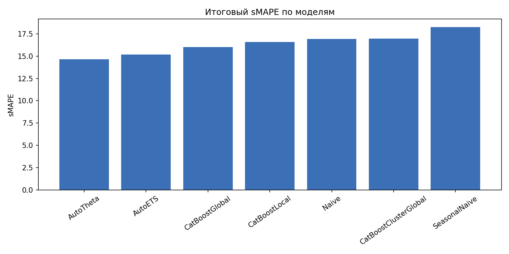
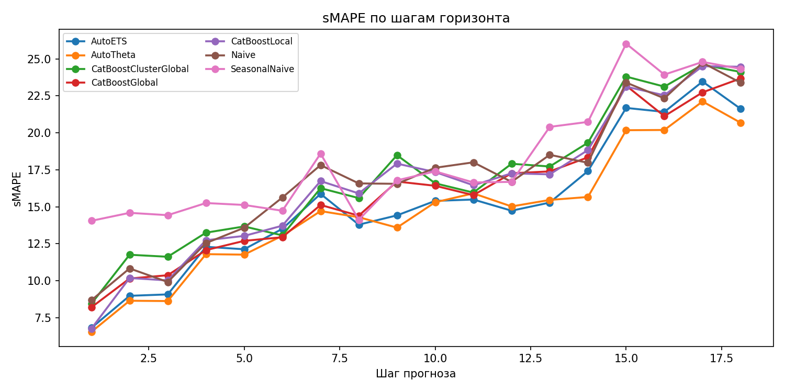
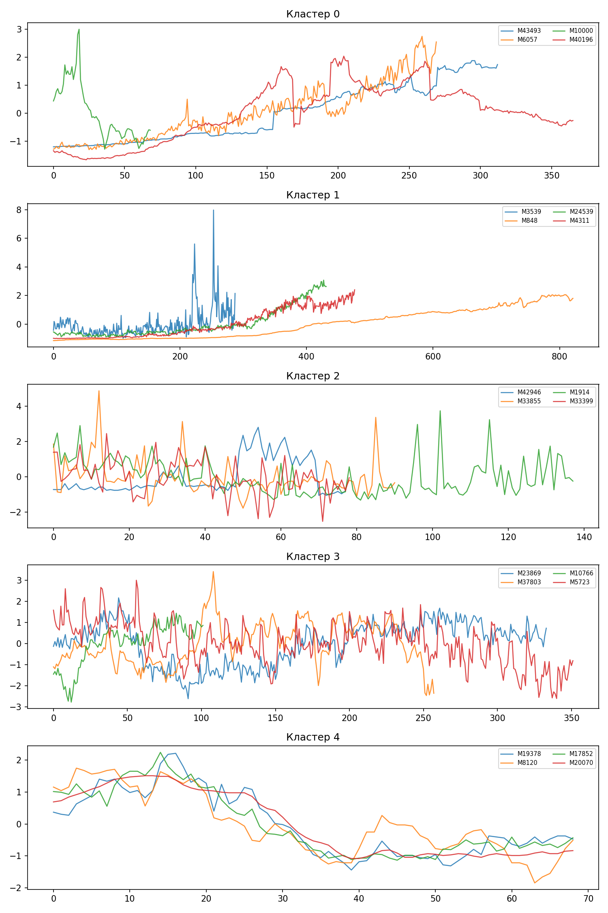

# Исследовательский отчет

## Тема проекта

Проверка гипотезы: локальные модели на каждый ряд проигрывают глобальным
моделям, если рядов много и они похожи по структуре.

## Распределение ролей

Проект выполнен индивидуально. Все этапы работы, включая подготовку
репозитория, реализацию кода, загрузку и обработку данных, запуск
экспериментов, анализ результатов и подготовку отчета, выполнены одним
человеком.

## Постановка задачи

Цель проекта состояла в том, чтобы проверить, помогает ли объединение
нескольких похожих временных рядов улучшить качество прогноза по сравнению с
локальным обучением на каждом ряде отдельно. Для этого было решено сравнить
одну и ту же основную модель `CatBoost` в трех режимах:

- локальная модель на каждый временной ряд;
- глобальная модель внутри кластеров похожих рядов;
- единая глобальная модель на всей выборке.

Чтобы сравнение было корректным, дополнительно использовались обязательные
бейзлайны `Naive`, `SeasonalNaive`, `AutoETS` и `AutoTheta`.

## Данные

В качестве данных использовался датасет `M4 Monthly` из `datasetsforecast`.
Выбор именно этой группы объясняется тремя причинами:

- в ней много месячных рядов, что делает задачу сравнения локальных и
  глобальных моделей содержательной;
- для месячных рядов естественно использовать сезонность `12`, поэтому
  сезонный бейзлайн применим без натяжек;
- объем данных остается реалистичным для аккуратного эксперимента в рамках
  одной недели.

В итоговом запуске использовалась воспроизводимая подвыборка из `120`
временных рядов. Горизонт прогноза составил `18`, сезонность была зафиксирована
равной `12`. Для всех рядов последние `18` наблюдений были отложены в тест, а
все предыдущие значения использовались для обучения.

## Методология эксперимента

Сначала на обучающей части каждого ряда рассчитывались простые статистические
признаки: длина ряда, среднее, стандартное отклонение, коэффициент вариации,
наклон линейного тренда, автокорреляция первого лага, сезонная
автокорреляция, а также сила тренда и сила сезонности на основе
`STL`-разложения. Эти признаки использовались для кластеризации рядов методом
`KMeans`.

Число кластеров выбиралось по метрике `silhouette score` среди значений от `2`
до `6`. Лучшее качество было достигнуто при `k = 5`, где `silhouette score`
составил `0.310`. Итоговое распределение рядов по кластерам оказалось
неравномерным: `64`, `4`, `23`, `25` и `4` ряда соответственно.

Для основной модели `CatBoost` использовались лаговые признаки
`1, 2, 3, 6, 12, 18, 24`, скользящие средние и стандартные отклонения по окнам
`3, 6, 12`, разность по первому лагу, сезонная разность и простые сезонные
признаки в виде синуса и косинуса. Перед обучением применялось масштабирование
по среднему абсолютному уровню каждого ряда, а после прогноза предсказания
возвращались в исходную шкалу. Все метрики считались только после этого
обратного преобразования.

Качество оценивалось по трем метрикам:

- `sMAPE` как основная метрика сравнения рядов разного масштаба;
- `MASE` как масштабно-нормированная ошибка;
- `RMSE` как чувствительная к крупным ошибкам дополнительная метрика.

Дополнительно результаты анализировались не только в среднем по всему
горизонту, но и по каждому шагу прогноза отдельно.

## Описание моделей

В отчете сравнивались следующие модели:

- `Naive`;
- `SeasonalNaive`;
- `AutoETS`;
- `AutoTheta`;
- `CatBoostLocal`;
- `CatBoostClusterGlobal`;
- `CatBoostGlobal`.

Бейзлайны `AutoETS` и `AutoTheta` запускались через библиотеку
`statsforecast`. Основное сравнение строилось вокруг `CatBoost`, чтобы
отследить влияние именно режима обучения, а не смены класса модели.

## Результаты

Итоговые метрики на подвыборке из `120` рядов представлены в таблице ниже.

| Модель | sMAPE | MASE | RMSE |
|---|---:|---:|---:|
| AutoTheta | 14.638 | 0.924 | 1106.265 |
| AutoETS | 15.186 | 0.920 | 1142.728 |
| CatBoostGlobal | 16.031 | 1.158 | 1304.643 |
| CatBoostLocal | 16.593 | 1.125 | 1287.164 |
| Naive | 16.930 | 1.086 | 1358.838 |
| CatBoostClusterGlobal | 16.958 | 1.142 | 1379.772 |
| SeasonalNaive | 18.254 | 1.190 | 1315.108 |

Среди всех моделей лучшей по `sMAPE` оказалась `AutoTheta`. Второе место заняла
`AutoETS`. Это означает, что на выбранной постановке классические
автоматические локальные модели оказались сильнее, чем все варианты `CatBoost`.

Если сравнивать только три варианта `CatBoost`, то лучшей оказалась единая
глобальная модель `CatBoostGlobal` со `sMAPE = 16.031`. Локальный вариант
получил `16.593`, а кластерный глобальный вариант `16.958`. Таким образом,
внутри класса `CatBoost` глобальное обучение действительно оказалось лучше
локального, но разница была умеренной, а кластеризация не принесла прироста.

Отдельный анализ по шагам горизонта показал, что внутри семейства `CatBoost`
глобальная модель была лучшей на `13` из `18` шагов горизонта, локальная
модель выигрывала на `5` шагах, а кластерный глобальный вариант не оказался
лучшим ни на одном шаге. Если же смотреть на все модели сразу, то:

- `AutoTheta` была лучшей на `13` шагах горизонта;
- `AutoETS` была лучшей на `4` шагах;
- `CatBoostGlobal` оказался лучшим только на `1` шаге.

Это означает, что преимущество классических моделей было не случайным и не
ограничивалось только усредненной метрикой на всем горизонте.

Ниже приведены автоматически сохраненные графики, полученные в эксперименте.

## Анализ результатов

Результат по гипотезе получился смешанным. Если сравнивать именно режимы
обучения `CatBoost`, то гипотеза частично подтверждается: общий глобальный
вариант действительно лучше локального. Значит, объединение информации по
нескольким рядам оказалось полезным даже для сравнительно простой табличной
модели с лаговыми признаками.

Однако гипотеза не подтвердилась в более сильной формулировке, если включать в
сравнение все модели. Лучшие результаты показали не глобальные модели, а
классические локальные автоматические подходы `AutoTheta` и `AutoETS`. Это
говорит о том, что сама идея глобального обучения полезна не всегда: ее
эффективность зависит и от выбранного класса модели, и от того, насколько
удачно устроены признаки.

Кластерный вариант `CatBoostClusterGlobal` оказался самым слабым из трех
вариантов `CatBoost`. Одна из возможных причин состоит в том, что найденные
кластеры были сильно несбалансированными: один кластер включал `64` ряда, два
кластера содержали лишь по `4` ряда. В такой ситуации модель внутри маленького
кластера уже почти не получает преимуществ глобального обучения, а деление на
кластеры может только уменьшать объем доступных данных.

Дополнительный анализ профилей кластеров показывает, что часть кластеров
действительно различалась по тренду и сезонности. Например, кластеры `0` и `3`
характеризовались высокой автокорреляцией и выраженной сезонной структурой, а
кластер `2` имел более слабую автокорреляцию и заметно меньшую силу тренда.
Тем не менее само наличие различий между кластерами не гарантировало улучшения
качества прогноза после разбиения выборки.

## Выводы

По итогам эксперимента можно сделать три основных вывода.

Во-первых, гипотеза частично подтверждается внутри класса `CatBoost`:
глобальная модель на всех рядах оказалась лучше локальной модели на каждом
ряде отдельно. Это означает, что перенос информации между рядами действительно
может быть полезен.

Во-вторых, кластеризация в текущей постановке не помогла. Глобальная модель по
кластерам не только не улучшила качество относительно общей глобальной модели,
но и проиграла локальному `CatBoost`. Вероятно, выбранные признаки
кластеризации и сильная несбалансированность кластеров сделали это разбиение
неудачным именно для задачи прогнозирования.

В-третьих, на выбранной подвыборке и с текущим набором признаков лучшие
результаты показали классические локальные методы `AutoTheta` и `AutoETS`.
Следовательно, гипотеза не подтверждается в полном виде: глобальное обучение
не гарантирует победу над локальными моделями вообще, хотя и может давать
выигрыш внутри конкретного класса моделей.

## Ограничения и дальнейшая работа

У проведенного эксперимента есть несколько ограничений:

- использовалась только одна подвыборка из `120` рядов;
- основная глобальная модель была только одна и относилась к табличным
  алгоритмам;
- кластеризация строилась по простым статистическим признакам, а не по более
  сложным представлениям формы ряда;
- не использовалась валидация по нескольким окнам.

В дальнейшем было бы полезно повторить эксперимент на нескольких разных
подвыборках, проверить другой способ кластеризации и сравнить `CatBoost` с
более сильной глобальной моделью, например нейросетевой архитектурой для
многорядного прогнозирования.
